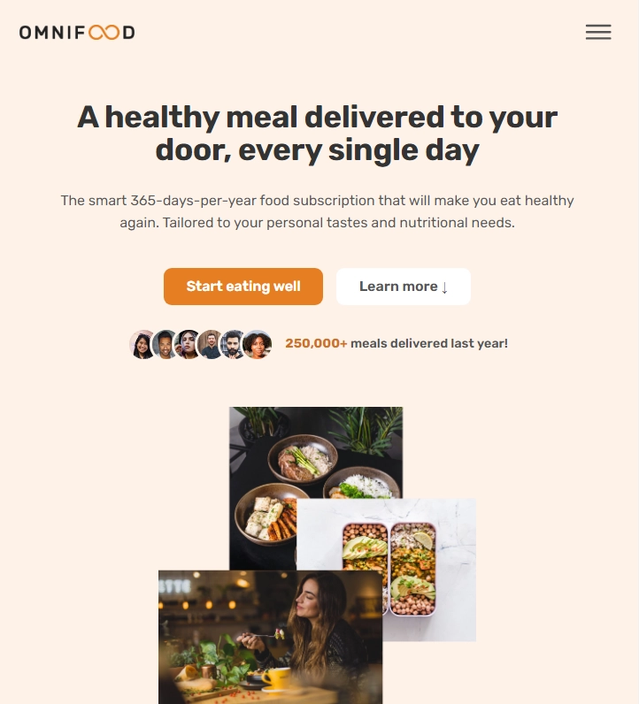

### 👋 **I am Erhan ERTEM**

&emsp;

## Udemy Build Responsive Real-World Websites with HTML and CSS by Jonas Schmedtmann

### **Objective:** Create Omnifood web page for a company that sells dietry food subscriptions.

-  Explore GRID and FLEXBOX principles of CSS
-  Create hero section, nav bar, form components, learn graphical CSS manipulations, establish media queries

&emsp;

#### [Omnifood Project](https://omnifood-erhan-ertem.netlify.app)

---

